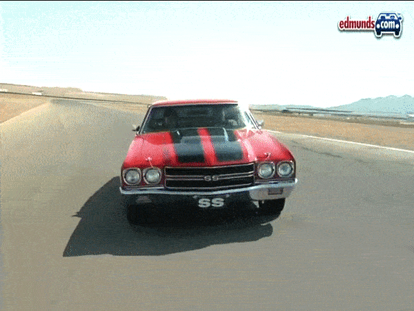
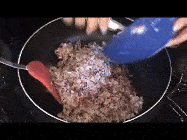
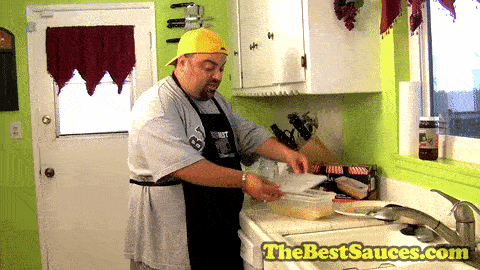
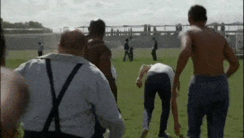
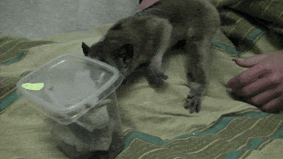
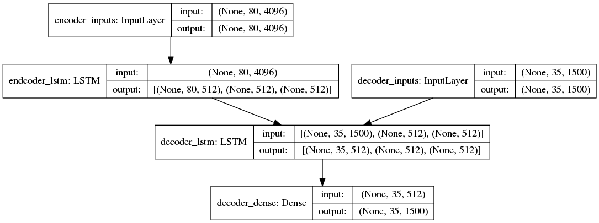
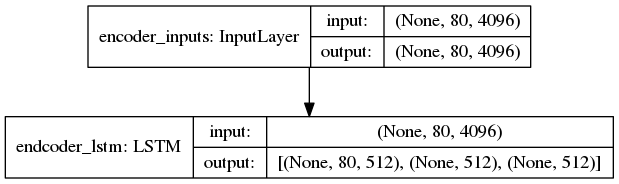
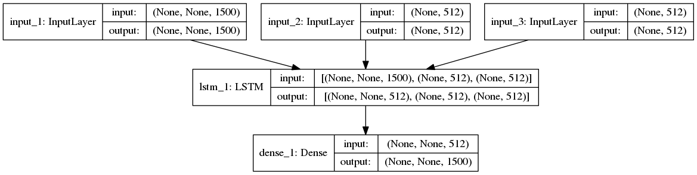

# Video2Text
An Encoder-Decoder Model for Sequence-to-Sequence learning: Video to Text

## Examples
|Video|Text|
|:-:|:-:|
||a man is driving down a road |
||a man is playing a guitar |
||a woman is cooking eggs in a bowl|
||a man eats pasta |
||a woman is slicing tofu |
||a person is mixing a tortilla |
||a group of people are dancing |
||a person is holding a dog |

## Dataset
MSVD Dataset ([Download](https://drive.google.com/file/d/0B18IKlS3niGFNlBoaHJTY3NXUkE/view))

1450 videos for training, 100 videos for testing 
> The input features are extracted by VGG(pretrained on the ImageNet).

## Model Structures
### Training Model


### Inference Model
#### Encoder


#### Encoder


## How to use the code
### video2text.py

```
usage: video2text.py [-h] --uid UID [--train_path TRAIN_PATH]
                     [--test_path TEST_PATH] [--learning_rate LEARNING_RATE]
                     [--batch_size BATCH_SIZE] [--epoch EPOCH] [--test]

Video to Text Model

optional arguments:
  -h, --help            show this help message and exit
  --uid UID             training uid
  --train_path TRAIN_PATH
                        training data path
  --test_path TEST_PATH
                        test data path
  --learning_rate LEARNING_RATE
                        learning rate for training
  --batch_size BATCH_SIZE
                        batch size for training
  --epoch EPOCH         epochs for training
  --test                use this flag for testing
```

Split the pre-extracted features of videos into training and testing directories. For training you may want to preprocess the data.

For testing, you should use the `--test` flag, and here is a sample script to generate the testing results!

```
python video2text.py --uid best --test
```

This generates the video-to-text output at [test_ouput.txt](models/best/test_output.txt), and the average bleu score is 0.295552708.

For more information, check out the [report](report.pdf).


## References
[Keras Blog: A ten-minute introduction to sequence-to-sequence learning in Keras](https://blog.keras.io/a-ten-minute-introduction-to-sequence-to-sequence-learning-in-keras.html)

[ADLxMLDS 2017 Fall Assignment 2](https://www.csie.ntu.edu.tw/~yvchen/f106-adl/A2)

## LICENSE
[MIT](LICENSE)